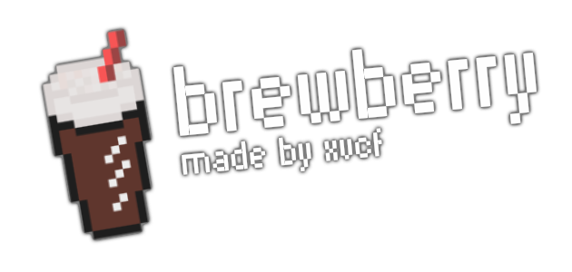

# Brewberry

A bar owner turns out to be sick and needs a replacement urgently! You decide to jump in, to serve root beer to customers!

## About Brewberry

Brewberry was made over the course of one weekend, for the Cozy Fall Jam 2026.

I made all of the sprites, the code, as well as the music myself, by hand. I did use sound effects from YouTube. You can find the credits here.

## Playing Brewberry

To play Brewberry, download a release for your OS of choice, or play it in the browser. You can find the releases at the bottom of the [itch.io page](https://xvcf.itch.io/brewberry).

## How does it even work?

There is a tutorial in the game. It should explain everything! To sum it up: you serve root beer customers order. They can pick whether they want you to remove the foam off the root beer, or add a straw for them. Depending on the size of the drink, you get money!

## My interpretation of the theme "Roots"

Well, roots, root beer; it's obvious, right? I didn't feel like making anything specifically related to trees, so I made a cozy little game where you serve root beer in a bar!

## Credits

Most assets were fully made by me. I made the sprites, the background music and pretty much everything else! I do have to give some credits for sound effects, though!

| Effect            | Source                                      |
| ----------------- | ------------------------------------------- |
| Cash Register     | https://www.youtube.com/watch?v=XAwlMEbsXAE |
| Call / Pickup SFX | https://www.youtube.com/watch?v=UfpU-44CfGE |
| Drink SFX         | https://www.youtube.com/watch?v=AUzgKiGspkw |
| Glass Place SFX   | https://www.youtube.com/watch?v=G64JRDoZJQA |
